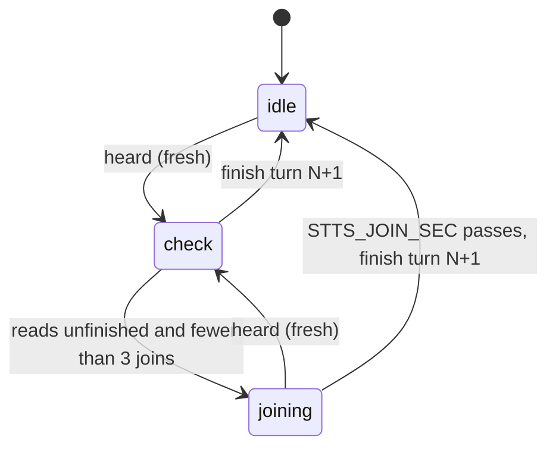

# Turns

## What it does

Turns what Mark says into numbered turns. Each heard reply starts with `[turn N, heard HH:MM:SS to HH:MM:SS]`, N always rises, repeats and stale speech are dropped, a sentence cut mid-thought is joined with what follows, and an agent cannot listen again before it has answered the last turn.

## Why it exists

Agents used to answer the same words twice, answer old speech, or ask him to finish a sentence the window had cut. Numbering and gating the turns makes the conversation strictly listen, answer, listen.

## How it works

`src/turns.ts` is an XState machine the daemon runs.

- **Dropped:** speech that ended before the last turn ended (stale), or the same text ending within 1 second of the last (duplicate).
- **Join:** if the speech reads unfinished (spec 001), the machine waits `STTS_JOIN_SEC` seconds (default 3) for more, up to 3 joins, then returns all of it as one turn.
- **Ack gate:** after a turn is returned it is unanswered. A tts call answers it. An stt call while it is unanswered gets status 409 with `turn N is unanswered. Answer it now with tts (listen=true), or, if it needs no spoken answer, call stt with ack=N.` An stt with `ack=N` passes and marks it answered.
- No-speech, listen-continues and background-result replies are not turns and change nothing.
- **Typed turns.** A message typed into the voice window is a turn exactly like heard speech: same prefix, ids, dedupe, join and ack gate. Typed with no listen open, it is held and returned by the next stt or tts listen.
- **Barge-in turns.** A turn that cut the agent's speech off is returned by the cut-off tts call itself, with the barge line after it (spec 003). It is unanswered like any turn. `BARGE_NOTE` in both tool descriptions tells the agent to treat it as an addition or steer and to continue the cut-off task unless it says stop, abort, halt or never mind (house rule 47).
- If the listen went away while a turn was joining, its words are kept and put in front of the next listen's speech.

## What it reads and writes

Reads `STTS_JOIN_SEC`. Holds turn state in memory only; a daemon restart starts again at turn 1.

## How to run, check and hand over

`test/unit/turns.test.ts` covers rising ids, dedupe and stale drops, joins and the 409 with `ack`. Run `npm test`.
