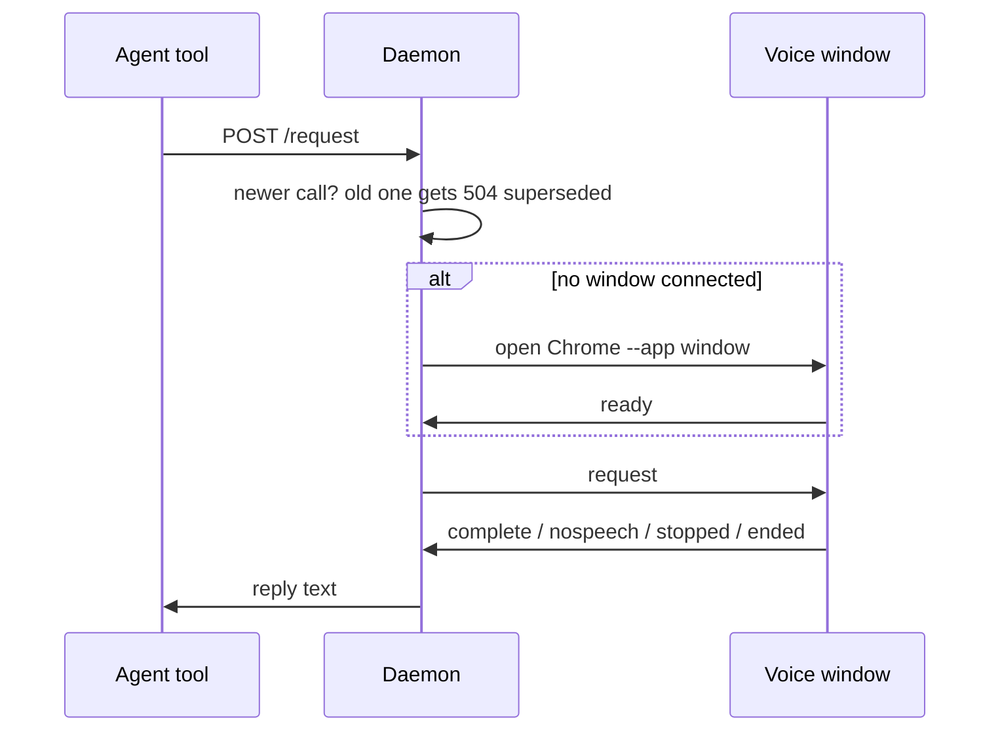

# Daemon slot and budget

## What it does

The daemon (`src/daemon.ts`) is one small local web service that holds at most one request at a time (the slot), hands it to the voice window, and answers within a time budget. It also opens the Chrome window and starts the Piper voice when they are needed.

## Why it exists

Tool calls are cut off by the agent after a few minutes, and two calls in flight used to fight over the mic. One slot and a fixed budget mean the newest call always wins and no call hangs.

## How it works

- **One slot.** A new request replaces the old one: the old caller gets `504 superseded`, and if the old one was a listen the page is told `released{superseded}` first. "Busy" is never returned.
- **Budget.** `STTS_REQUEST_TIMEOUT_MS`, default 240000 (240 s). A listen that reaches it sends `released{timeout}` and returns `__STTS_LISTEN_CONTINUES__`; speech that arrives after is kept and given to the next listen. A speak that reaches it returns `Spoken.`.
- **Page answers.** `complete` during a listen feeds the turns machine (spec 002); during a speak it returns `Spoken.`; with no open request it is dropped. `nospeech` returns `__STTS_NO_SPEECH__`. `stopped{part}` returns `__STTS_STOPPED__ <part>`. `cancel`, `close` and `ended` return `__STTS_CONVERSATION_ENDED__`; `close` and `ended` also stop the daemon.
- **Close.** `close=true` is honoured only from `who=session`; from `who=agent` it is ignored.
- **Window.** If no page is connected, the daemon launches Chrome with chrome-launcher as an `--app` window at 1600x600, with its own profile `profile` (or `profile-<port>` on a non-default port) and debugging port `port + 100`. When Chrome exits, the daemon exits.
- **Piper.** `/voice/clip` forwards to Piper on port 15987, or `STTS_PIPER_PORT` (the e2e tests point it at a fake server), at `/synthesize`. If nothing answers, the daemon starts Piper from `<data>/piper/venv` (or `STTS_PIPER_HOME`) with the requested voice and retries for up to 15 seconds. Piper runs as a separate process, so its GPL licence stays out of this code.
- **Single instance.** Binding the port is the lock. If the port is taken, the new process pings it and exits 0 when a live daemon answers `ok`, otherwise 1.

## What it reads and writes

Reads environment `STTS_PORT`, `STTS_REQUEST_TIMEOUT_MS`, `STTS_JOIN_SEC`, `STTS_PIPER_HOME`. Writes the Chrome profile and `daemon.log` (spec 012) under `%LOCALAPPDATA%\cc-gc-stts\` (on Linux `~/.local/share/cc-gc-stts/`). Serves `dist/web/` and `dist/earcon/`.

## How to run, check and hand over

`node dist/daemon.js` after `npm run build`; normally the client starts it (spec 008). `test/unit/daemon.test.ts` and `integration.test.ts` drive it through hono `app.request()` with no socket: supersede and `released`, budget returns continues, `/notify`, the `/barge` shape, agent close ignored, second instance exits 0, and 1,000 supersedes with no leaked slot.
