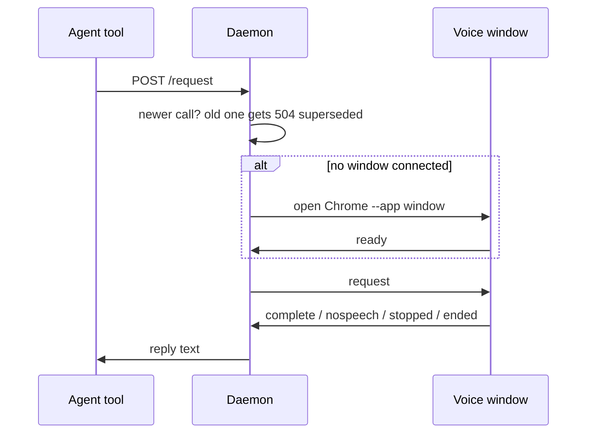

# Daemon slot and budget

## What it does

The daemon (`src/daemon.ts`) is one small local web service that holds at most one request at a time (the slot), hands it to the voice window, and answers within a time budget. It also opens the Chrome window and starts the Piper voice when they are needed.

## Why it exists

Tool calls are cut off by the agent after a few minutes, and two calls in flight used to fight over the mic. One slot and a fixed budget mean the newest call always wins and no call hangs.

## How it works

- **One slot.** A new request replaces the old one: the old caller gets `504 superseded`, and if the old one was a listen the page is told `released{superseded}` first. "Busy" is never returned.
- **Budget.** `STTS_REQUEST_TIMEOUT_MS`, default 240000 (240 s). A listen that reaches it sends `released{timeout}` and returns `__STTS_LISTEN_CONTINUES__`; speech that arrives after is kept and given to the next listen. A speak that reaches it returns `Spoken.`.
- **Page answers.** `complete` during a listen feeds the turns machine (spec 002); during a speak it returns `Spoken.`; with no open request (after a Stop, a restart or a hand-off) the words are held and returned by the next listen, never dropped (log `page heard held for the next listen`). A request is sent to the page once: a reconnect, a reload, an unmute or a joining sentence resends a tts with listen as its listen only, and a plain tts already sent returns `Spoken.`, so speech is never replayed (2026-10-06: the daemon resent the whole tts while a sentence was joining, and Mark heard an earlier reply again). A typed `complete` (`source: typed`) with no listen open is held, never dropped, and returned as a turn by the next listen; the daemon logs `page typed held for the next listen` and, when it becomes a turn, `page typed turn N`.
- **Barge-in.** A `complete` with `interrupted{part,sentence}` while any request is open (a speak, a speak with listen, or a read-aloud part) feeds the turns machine, and that request returns the turn, `[turn N, heard ...] text`, followed on the next line by `bargeLine(part, sentence)` from `src/protocol.ts`: `(interrupted your speech at part P sentence S: treat this as an addition and continue the cut-off task unless it says stop, abort, halt or never mind)`. A read-aloud stops at that part. The stopped speech's own empty `complete` that follows is ignored. `nospeech` returns `__STTS_NO_SPEECH__`. `stopped{part}` returns `__STTS_STOPPED__ <part>`. Words that arrive with no listen open, or while a speak-only tts is open, are held and returned by the next listen; they used to end the speak-only tts and be lost (2026-10-07). `cancel` and `close` return `__STTS_NO_SPEECH__`: only the End button ends a conversation, and a closed, hidden or crashed window never does; the next call reopens it (Mark 2026-10-07). **End is never lost:** `ended` writes `<data>/ended` first, so a press mid-speech, between calls or with no call open survives a respawn or hand-off. The first reply after it (the open call, a `stopped`, or the next request) answers `__STTS_CONVERSATION_ENDED__` and deletes the file, so an End reaches exactly one reply. It used to persist until a `start: true` call, so a press from the day before ended the next session's first stt (2026-10-07). A request with `start: true` deletes an undelivered End. The daemon stays up (spec 013: the newest daemon keeps the port).
- **Close.** `close=true` is honoured only from `who=session`; from `who=agent` it is ignored.
- **Window.** If no page is connected, the daemon launches Chrome with chrome-launcher as an `--app` window at 1600x600, with its own profile `profile` (or `profile-<port>` on a non-default port; `STTS_PROFILE_DIR` overrides it) and debugging port `port + 100`. When Chrome exits, the daemon exits. If no page connects within 15 s the daemon logs `window open timed out` and the next request launches again. A launch that fails (including chrome-launcher returning no process) logs `chrome launch failed <reason>` once and never throws out of the request.
- **Piper.** `/voice/clip` forwards to Piper on port 15987, or `STTS_PIPER_PORT` (the e2e tests point it at a fake server), at `/synthesize`. If nothing answers, the daemon starts Piper from `<data>/piper/venv` (or `STTS_PIPER_HOME`) with the requested voice and retries for up to 15 seconds. A Piper that exits is forgotten, so the next clip starts a fresh one. The page (`/`) is served with `Cache-Control: no-cache`. `POST /voice/warm` `{voice}` starts Piper early (the page calls it on load) and answers 204. `GET /voice/list` returns the installed Piper voices: every `.onnx` in `<piper home>/voices`, by name, sorted. Piper runs as a separate process, so its GPL licence stays out of this code.
- **Single instance.** Binding the port is the lock. If the port is taken, the new process pings it and exits 0 when a live daemon answers `ok`, otherwise 1.

## What it reads and writes

Reads environment `STTS_PORT`, `STTS_REQUEST_TIMEOUT_MS`, `STTS_JOIN_SEC`, `STTS_PIPER_HOME`. Writes the Chrome profile and `daemon.log` (spec 012) under `%LOCALAPPDATA%\cc-gc-stts\` (on Linux `~/.local/share/cc-gc-stts/`). Serves `dist/web/` and `dist/earcon/`.

## How to run, check and hand over

`node dist/daemon.js` after `npm run build`; normally the client starts it (spec 008). `test/unit/daemon.test.ts` and `integration.test.ts` drive it through hono `app.request()` with no socket: supersede and `released`, budget returns continues, `/notify`, the `/barge` shape, agent close ignored, second instance exits 0, and 1,000 supersedes with no leaked slot.
