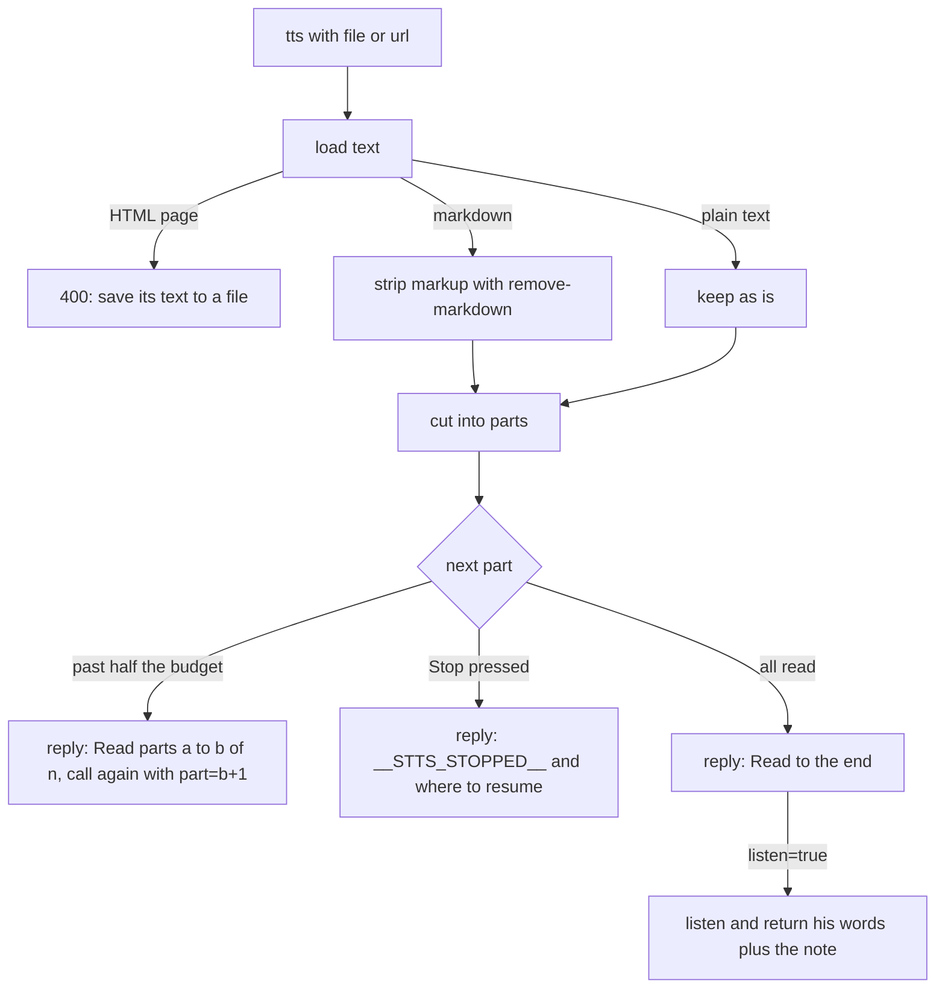

# File read-aloud in parts

## What it does

Lets an agent read out an existing file or web text (a story, a chapter, notes) by passing `file` or `url` to tts instead of copying the words. The daemon loads it, cuts it into parts of at most 1000 characters, speaks them in order, and says where to resume when it stops early.

## Why it exists

Pasting a long document into a tool call costs the agent output and time. Reading by reference is free for the agent, and parts let a long read survive the tool-call time limit.

## How it works

- `src/sentences.ts` cuts at sentence ends with the built-in `Intl.Segmenter`, packing sentences into parts of at most 1000 characters. A longer sentence is cut at a space, or hard-cut if it has none. The callbot imports this file.
- Markdown (`.md`, `.markdown`, `.mdx`, or a markdown content type or URL) has its markup removed. Plain text is left alone. An HTML page is refused.
- `part=N` starts at part N; a part past the end is refused with the part count.
- No new part starts after half the budget (spec 003). The reply notes keep their exact text: `Read parts A to B of N. To go on, call tts again with the same file and part=B+1.`, `He stopped it during part P of N. To resume there, call tts with the same file and part=P.`, `Read to the end (part N of N).`
- A newer request supersedes the read between parts.

## What it reads and writes

Reads the named local file, or fetches the URL with a 10 second limit. Writes nothing.

## How to run, check and hand over

`test/unit/sentences.test.ts` covers empty input, a 5 MB file, text with no sentence end, the 1000 character boundary and Windows paths. The daemon tests cover parts, resume and stop. Run `npm test`.
