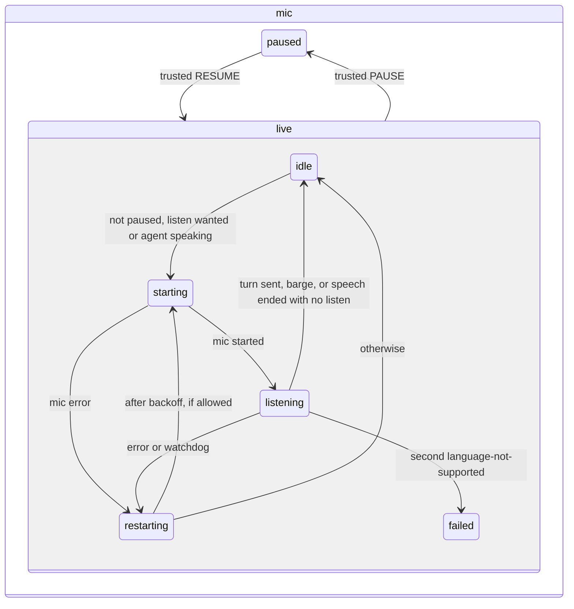

# Page machine and mute

## What it does

Decides, inside the voice window, when the mic is on, when a turn is sent, when the agent's voice plays, and when a stuck mic is restarted. Mute is absolute: once Mark mutes, nothing but his own click or key turns the mic back on.

## Why it exists

The old page used loose flags, and a mic error or watchdog could restart the mic while he had muted it. Putting every rule in one state machine (`web/machine.ts`, XState v5) makes "muted means muted" part of the structure, and lets tests prove it.

## How it works

Five regions run side by side:

| Region | States and rules |
| --- | --- |
| mic | `paused`, or `live` with `idle`, `starting`, `listening`, `restarting`, `failed`. The mic starts only in `starting`, and only when not paused and either a listen is wanted or the agent is speaking. It keeps running through the speech (so speaking over the agent barges in) and goes off when the speech ends with no listen wanted. A tts with listen keeps the same mic on into the listen, with no restart. Pause and resume come only from a trusted click, Ctrl+M or Ctrl+R. |
| turn | Not listening (grey), speak now (green), heard (amber), background result (amber), agent speaking (blue). |
| autosend | Armed when a final result lands (the recogniser's own end of an utterance) or his speech ends; interim words cancel it and a later final restarts the hold. Chrome's speechend in continuous mode fires only when the session ends, so arming on it alone held every turn about 15 s (2026-10-06). Sends after 0.7 s, or 1 s if the speech reads unfinished. New speech, mute, a typed send or switching auto-send off cancels it, and it never arms while text is in the keyboard box (`SET_TYPING`). |
| speech | Idle, or playing a queue of clips with up to 3 fetched ahead. A clip that fails is logged as `voice fallback REASON`, then spoken by the browser's own voice. When the queue empties with a listen wanted and the mic running, the turn goes straight to speak now. Stop drops the queue at once, because the paused clip never ends and would otherwise block the next speak. |
| watchdog | Every 2 s while the mic runs: restart if the mic is not running for 6 s, heard speech gave no words for 8 s, or there was no audio for 15 s. While speech plays only the first rule applies: silence or wordless sound then is expected. A recogniser that ends on its own during a listen restarts at once. Only the current recogniser's events reach the machine (a stopped one fires its end late), and stopping the mic also closes its capture stream. After an error the restart is immediate, then backs off doubling up to 2 s. |

Before the first start the page asks `SpeechRecognition.available({langs: ['en-US'], processLocally: true})`. `available` uses on-device recognition; `downloadable` starts `SpeechRecognition.install()` and uses cloud recognition until it lands; anything else uses cloud recognition. A `language-not-supported` error switches to cloud and restarts once; a second one moves the mic to `failed`: the status icon turns red, the page logs `mic failed language-not-supported` once, and nothing restarts until a mute and unmute.

Every listen (an stt, or the listen after a tts with `listen=true`) starts with no heard words: the page clears what it heard before the listen opened and the turn's start time, then arms the `idleSec` timer. Words left over from before the listen made the timer skip `nospeech`, so the listen hung until the daemon's budget (seen through the gateway, 2026-10-05).

A typed send is the `TYPED` event: the turn region goes to heard and the `deliver` action sends it as a `complete{source: typed}`. It needs no mic, so it works while muted (the mic stays paused, `startMic` never fires) and while no listen is open (the daemon holds it). If the agent is speaking, `TYPED`, or `BARGE` (final heard words while speech plays), is a barge: `deliver` sends the turn with `interrupted{part, sentence}` first, then `stopAudio` silences the clip and the queue is emptied, the Stop button's path. The context keeps `sentence` (the clip now playing) and `interrupted`. While the agent speaks the page listens on the same echo-cancelled, noise-suppressed mic track: interim words are ignored, and only a final of 3 or more words sends `BARGE`. Shorter finals are dropped. A final is the agent's own voice, dropped with `echo discarded` logged once per sentence, when it arrives under 600 ms into the clip, or when it matches any sentence spoken in the last 10 s (`isEcho`: lowercase, no punctuation, Levenshtein similarity from the pinned `fastest-levenshtein` at least 0.5, or under 60 percent of the sentence's length and sharing its first or last two words). The same check drops an echo final that lands just after speech ends, so it never becomes a turn. Known ceiling: an echo garbled past half slips through and a barge that repeats the sentence is dropped. The live failure that set this: "Cutover complete" heard as "Gun over complete". The mic opening during speech plays no chime.

A listen request that arrives while muted is remembered but does not start the mic. The window title reads `stts (muted)` while muted. The page logs `mic start`, `mic restart #N: reason`, `paused by Mark` and `resumed by Mark` (spec 012).

## What it reads and writes

Events from the browser's speech recognition and audio, and the daemon's messages. It writes nothing itself; the page (spec 006) carries out its actions.

## How to run, check and hand over

`test/unit/machine.test.ts` includes the mute test: PAUSE, then MIC_ERROR, WATCHDOG, a listen request and QUEUE_EMPTY must leave the state in `mic.paused` with no mic start. It also covers a typed send while muted (a turn, no mic start), typing suspending auto-send, `BARGE` stopping speech and recording where, a spoken barge during playback with interims and short finals ignored, the mic staying on through speech without a watchdog restart, mute holding through speech, `bargeVerdict`, and `isEcho` with real mishearings ("Gun over complete" for "Cutover complete" and five more) and three true barge-ins that must pass. `test/e2e/voice.spec.ts` speaks over a held speech with the fake recogniser: its echo is discarded, then a real final comes back from the tts call with the barge line. Run `npm test`.
