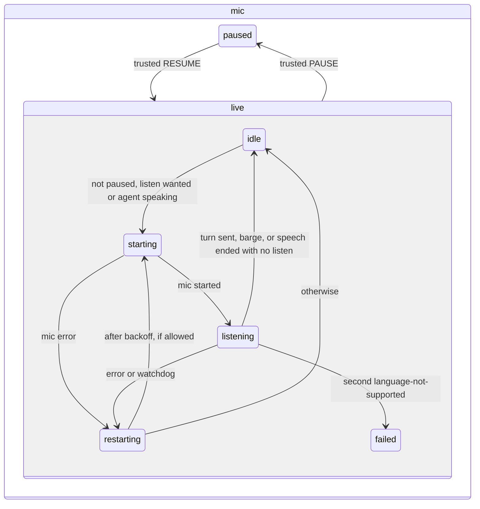

# Page machine and mute

## What it does

Decides, inside the voice window, when the mic is on, when a turn is sent, when the agent's voice plays, and when a stuck mic is restarted. Mute is absolute: once Mark mutes, nothing but his own click or key turns the mic back on.

## Why it exists

The old page used loose flags, and a mic error or watchdog could restart the mic while he had muted it. Putting every rule in one state machine (`web/machine.ts`, XState v5) makes "muted means muted" part of the structure, and lets tests prove it.

## How it works

Five regions run side by side:

| Region | States and rules |
| --- | --- |
| mic | `paused`, or `live` with `idle`, `starting`, `listening`, `restarting`, `failed`. The mic starts only in `starting`, and only when not paused and either a listen is wanted or the agent is speaking. It keeps running through the speech (so speaking over the agent barges in) and goes off when the speech ends with no listen wanted. A tts with listen keeps the same mic on into the listen, with no restart. Pause and resume come only from a trusted click, Ctrl+M or Ctrl+R. |
| turn | Not listening (grey), speak now (green), heard (amber), background result (amber), agent speaking (blue). |
| autosend | Armed when a final result lands (the recogniser's own end of an utterance) or his speech ends; interim words cancel it and a later final restarts the hold. It arms only while a listen is open, and a closed listen or new speech cancels it: a late speechend after the turn went out used to send a second turn and close the next listen, which left the light grey and the mic off after the agent spoke (log 2026-10-06). Unmuting asks the daemon to resend an open listen (`relisten`). The light turns green only while a listen is open: a stopped recogniser's late speechend used to send a stale turn right after a watchdog restart, which closed the listen while the restarted mic still showed green, so his next words went nowhere (log 2026-10-06, 21:22 to 21:29 UTC). Chrome's speechend in continuous mode fires only when the session ends, so arming on it alone held every turn about 15 s (2026-10-06). Sends after 0.8 s, or 1.2 s if the speech reads unfinished (it ends on a word like "and", "like" or "if"), 0.5 s more for interim words; but never while his voice is still on the mic: the page reads the mic level with the browser's Web Audio analyser (voice is 3 times the room's noise floor, at least 0.015), and while it was above that in the last 0.4 s the hold starts again. 30 s with no new words while the level stays up (a loud room) sends anyway. Turns used to go out mid-sentence whenever the recogniser went quiet for a second while he talked (2026-10-06 11:09). The mic stays on after every turn, and the results already sent are skipped: a turn that read finished ("it's not") used to close the mic, and the rest of his sentence was lost (Mark 2026-10-07). If the turn reads unfinished, the daemon joins what he says next to it; otherwise his later words go out as the next turn, or are held by the daemon for the next listen. A late speechend that repeats the turn just sent is ignored. New speech, mute, a typed send or switching auto-send off cancels it, and it never arms while text is in the keyboard box (`SET_TYPING`). |
| speech | Idle, or playing a queue of clips with up to 3 fetched ahead. A clip that fails is logged as `voice fallback REASON`, then spoken by the browser's own voice. When the queue empties with a listen wanted and the mic running, the turn goes straight to speak now. Stop drops the queue at once, because the paused clip never ends and would otherwise block the next speak. |
| watchdog | Every 2 s while the mic runs: restart only if the recogniser is not running for 6 s. A running recogniser is never aborted for silence or wordless sound, as in the old stts (sandipchitale/cc-gc-stts 1.0.0): the 8 s no-words and 15 s no-audio restarts threw away speech in flight, 14 restarts in two minutes turned a 2-minute turn into "Hello" (Mark 2026-10-07). The rest of this row describes the restart path when the recogniser does end. While speech plays only the first rule applies: silence or wordless sound then is expected. A recogniser that ends on its own during a listen restarts at once. A restart resets the speech-heard clock: keeping the old one tripped the 8 s rule on every restart, a loop every 3.5 s that cut his words off (log 2026-10-06 21:44 to 21:47 UTC). Automatic restarts open the mic without the listen chime; the chime plays only when a listen opens after the agent speaks or after an unmute. Only the current recogniser's events reach the machine (stopping one clears it, so its late end, error or speechend moves nothing), and stopping the mic also closes its capture stream. Stopping the mic aborts the recogniser (a stop waits for a final the service may never send). A start that reports nothing within 5 s restarts (`mic start timed out`). The start reads the machine only after one await: as an entry action it ran mid-transition, so an automatic restart (no chime) never opened the mic, which left the light grey after every reply (reproduced in real Chrome, 2026-10-06). Words that are still interim when a session stops, ends or fails are kept as heard. Interim words also arm auto-send, with 0.5 s more hold: Chrome's cloud recogniser kept every result interim through a 12 s pause, so cloud turns waited for the 60 s session end. Speech detected with no words is background noise: the mic restarts silently and the listen stays open, so noise never ends a listen (Mark 2026-10-06: a lost-speech marker fired on noise). After an error the restart is immediate, then backs off doubling up to 2 s. |

Recognition is the daemon's local speech engine (spec 014). The cloud and on-device Chrome recognisers and their setting are gone: both lost his words (2026-10-07).

Every listen (an stt, or the listen after a tts with `listen=true`) starts with no heard words: the page clears what it heard before the listen opened and the turn's start time, then arms the `idleSec` timer. Words left over from before the listen made the timer skip `nospeech`, so the listen hung until the daemon's budget (seen through the gateway, 2026-10-05).

A typed send is the `TYPED` event: the turn region goes to heard and the `deliver` action sends it as a `complete{source: typed}`. It needs no mic, so it works while muted (the mic stays paused, `startMic` never fires) and while no listen is open (the daemon holds it). If the agent is speaking, `TYPED`, or `BARGE` (final heard words while speech plays), is a barge: `deliver` sends the turn with `interrupted{part, sentence}` first, then `stopAudio` silences the clip and the queue is emptied, the Stop button's path. The context keeps `sentence` (the clip now playing) and `interrupted`. While the agent speaks the page listens on the same echo-cancelled, noise-suppressed mic track: interim words are ignored, and only a final of 3 or more words sends `BARGE`. Shorter finals are dropped. A final is the agent's own voice, dropped with `echo discarded` logged once per sentence, when it arrives under 600 ms into the clip, or when it matches any sentence spoken in the last 30 s (`isEcho`: lowercase, no punctuation, Levenshtein similarity from the pinned `fastest-levenshtein` at least 0.5, or under 60 percent of the sentence's length and sharing its first or last three words, or, for 4 words or more, at least 0.7 similar to any run of the sentence's words one shorter to one longer than what was heard, so a fragment from the middle of a long sentence is caught too). The same check drops echo words that land within 3 s after speech ends, final or interim; after that his words are never checked, since short phrases of his own that resembled the agent's cut long turns down to their first words (2026-10-06 09:49) (interim words also send turns), so they never become a turn (2026-10-06: the agent's reply came back as turn 7). Known ceiling: an echo garbled past half slips through and a barge that repeats the sentence is dropped. The live failure that set this: "Cutover complete" heard as "Gun over complete". The mic opening during speech plays no chime.

A listen request that arrives while muted is remembered but does not start the mic. The window title reads `stts (muted)` while muted. The page logs `mic start`, `mic restart #N: reason`, `paused by Mark` and `resumed by Mark` (spec 012).

## What it reads and writes

Events from the browser's speech recognition and audio, and the daemon's messages. It writes nothing itself; the page (spec 006) carries out its actions.

## How to run, check and hand over

`test/unit/machine.test.ts` includes the mute test: PAUSE, then MIC_ERROR, WATCHDOG, a listen request and QUEUE_EMPTY must leave the state in `mic.paused` with no mic start. It also covers a typed send while muted (a turn, no mic start), typing suspending auto-send, `BARGE` stopping speech and recording where, a spoken barge during playback with interims and short finals ignored, the mic staying on through speech without a watchdog restart, mute holding through speech, `bargeVerdict`, and `isEcho` with real mishearings ("Gun over complete" for "Cutover complete" and five more) and three true barge-ins that must pass. `test/e2e/voice.spec.ts` speaks over a held speech with the fake recogniser: its echo is discarded, then a real final comes back from the tts call with the barge line. Run `npm test`.
