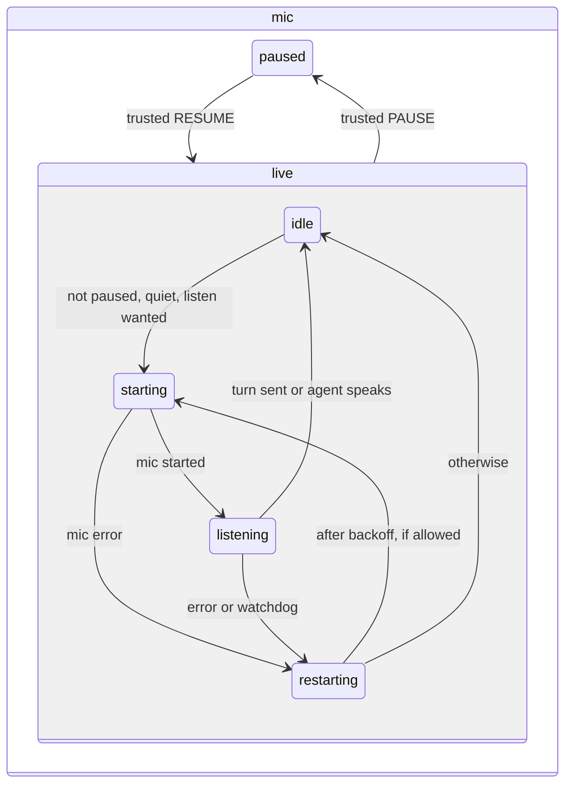

# Page machine and mute

## What it does

Decides, inside the voice window, when the mic is on, when a turn is sent, when the agent's voice plays, and when a stuck mic is restarted. Mute is absolute: once Mark mutes, nothing but his own click or key turns the mic back on.

## Why it exists

The old page used loose flags, and a mic error or watchdog could restart the mic while he had muted it. Putting every rule in one state machine (`web/machine.ts`, XState v5) makes "muted means muted" part of the structure, and lets tests prove it.

## How it works

Five regions run side by side:

| Region | States and rules |
| --- | --- |
| mic | `paused`, or `live` with `idle`, `starting`, `listening`, `restarting`. The mic starts only in `starting`, and only when not paused, no speech is playing, and a listen is wanted. Pause and resume come only from a trusted click, Ctrl+M or Ctrl+R. |
| turn | Not listening (grey), speak now (green), heard (amber), background result (amber), agent speaking (blue). |
| autosend | Armed when his speech ends: sends after 0.7 s, or 1 s if the speech reads unfinished. New speech, mute or switching auto-send off cancels it. |
| speech | Idle, or playing a queue of clips with up to 3 fetched ahead. A clip that fails is spoken by the browser's own voice instead. When the queue empties, the mic may resume. |
| watchdog | Every 2 s during a listen: restart if the mic is not running for 6 s, heard speech gave no words for 8 s, or there was no audio for 15 s. After an error the restart is immediate, then backs off doubling up to 2 s. |

A listen request that arrives while muted is remembered but does not start the mic. The window title reads `stts (muted)` while muted. The page logs `mic start`, `mic restart #N: reason`, `paused by Mark` and `resumed by Mark` (spec 012).

## What it reads and writes

Events from the browser's speech recognition and audio, and the daemon's messages. It writes nothing itself; the page (spec 006) carries out its actions.

## How to run, check and hand over

`test/unit/machine.test.ts` includes the mute test: PAUSE, then MIC_ERROR, WATCHDOG, a listen request and QUEUE_EMPTY must leave the state in `mic.paused` with no mic start. Run `npm test`.
