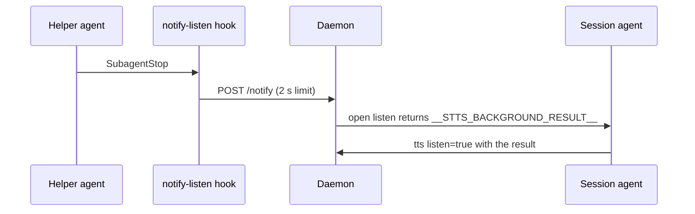

# Plugin shell and hooks

## What it does

Packages stts as the Claude Code plugin `stts` in the marketplace `stts-marketplace`: the `/stts` command that runs the voice loop, a skill with the same instructions, the MCP server entry, and a hook that interrupts a listen when a background helper finishes.

## Why it exists

The plugin is how an agent session gets voice with one install. The hook lets Mark hear a helper's result the moment it is ready instead of after his next sentence.

## How it works

- `.claude-plugin/plugin.json` and `marketplace.json` name the plugin and point at `github.com/markkennethbadilla/stts`. There is no version field; the commit is the version.
- `.mcp.json` registers `stts-mcp` as `node ${CLAUDE_PLUGIN_ROOT}/dist/mcp.js` (spec 008).
- `commands/stts.md` (and `commands/stts.toml` for agents that read TOML) and `skills/stts/SKILL.md` tell the agent the loop: call stt, act on each sentinel, answer every turn with tts and `listen=true`, speak before working, write for the ear.
- `hooks/hooks.json` runs `hooks/notify-listen.mjs` on every `SubagentStop`, with a 5 second limit.

The hook always exits 0, even when the daemon is down or slow. With no open listen, `/notify` does nothing.

## What it reads and writes

The hook reads `STTS_PORT` and makes one local HTTP call. Nothing is written.

## How to run, check and hand over

`test/unit/hook.test.ts` proves the hook exits 0 with the daemon down. After an install, run `/stts` in Claude Code and check the window opens.
