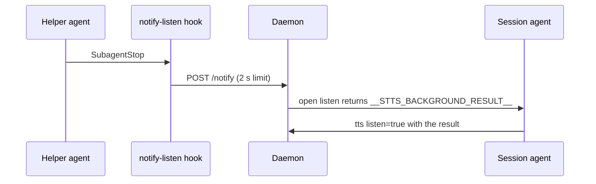

# Plugin shell and hooks

## What it does

Packages stts as the Claude Code plugin `stts` in the marketplace `stts-marketplace`: the `/stts` command that runs the voice loop, a skill with the same instructions, the MCP server entry, and a hook that interrupts a listen when a background helper finishes.

## Why it exists

The plugin is how an agent session gets voice with one install. The hook lets Mark hear a helper's result the moment it is ready instead of after his next sentence.

## How it works

- `.claude-plugin/plugin.json` and `marketplace.json` name the plugin and point at `github.com/markkennethbadilla/stts`. There is no version field; the commit is the version.
- `.mcp.json` registers `stts-mcp` as `node ${CLAUDE_PLUGIN_ROOT}/dist/mcp.js` (spec 008).
- `commands/stts.md` (and `commands/stts.toml` for agents that read TOML) and `skills/stts/SKILL.md` tell the agent the loop: call stt, act on each sentinel, answer every turn with tts and `listen=true`, speak before working, write for the ear.
- `hooks/hooks.json` runs `hooks/notify-listen.mjs` on every `SubagentStop`, with a 5 second limit.

The hook always exits 0, even when the daemon is down or slow. With no open listen, `/notify` does nothing; nothing is latched for a later listen.

The hook skips an agent that runs inside a Workflow (`agent_type` `workflow-subagent`, or a transcript under `subagents/workflows/`). The session gets a task-notification only when the whole workflow finishes, not per inner agent, so releasing the listen for each one made the loop spin on `__STTS_BACKGROUND_RESULT__` with nothing to relay (2026-10-09, seven releases in one workflow). Claude Code fires no hook when a workflow itself finishes, so a workflow run during voice signals its own end: its last step is one agent that runs `curl -s -m 5 -X POST "http://127.0.0.1:15986/notify?delayMs=5000"`. A workflow script has no `fetch`, so the call needs an agent. That agent pings before the workflow returns. With no delay, the listen came back about a second before the task-notification, and the session had nothing to relay (measured 2026-10-10). `delayMs` (0 to 30000; a bad value means 0) makes the daemon release whatever listen is open that many milliseconds later. Five seconds covers the agent's last reply and the workflow's return.

## What it reads and writes

The hook reads the `SubagentStop` payload on stdin and `STTS_PORT`, and makes at most one local HTTP call. Nothing is written.

## How to run, check and hand over

`test/unit/hook.test.ts` proves the hook exits 0 with the daemon down, and that a workflow agent's stop does not reach `/notify` while a top-level agent's stop does. `test/unit/daemon.test.ts` proves `/notify?delayMs` holds the release for the delay. After an install, run `/stts` in Claude Code and check the window opens.
