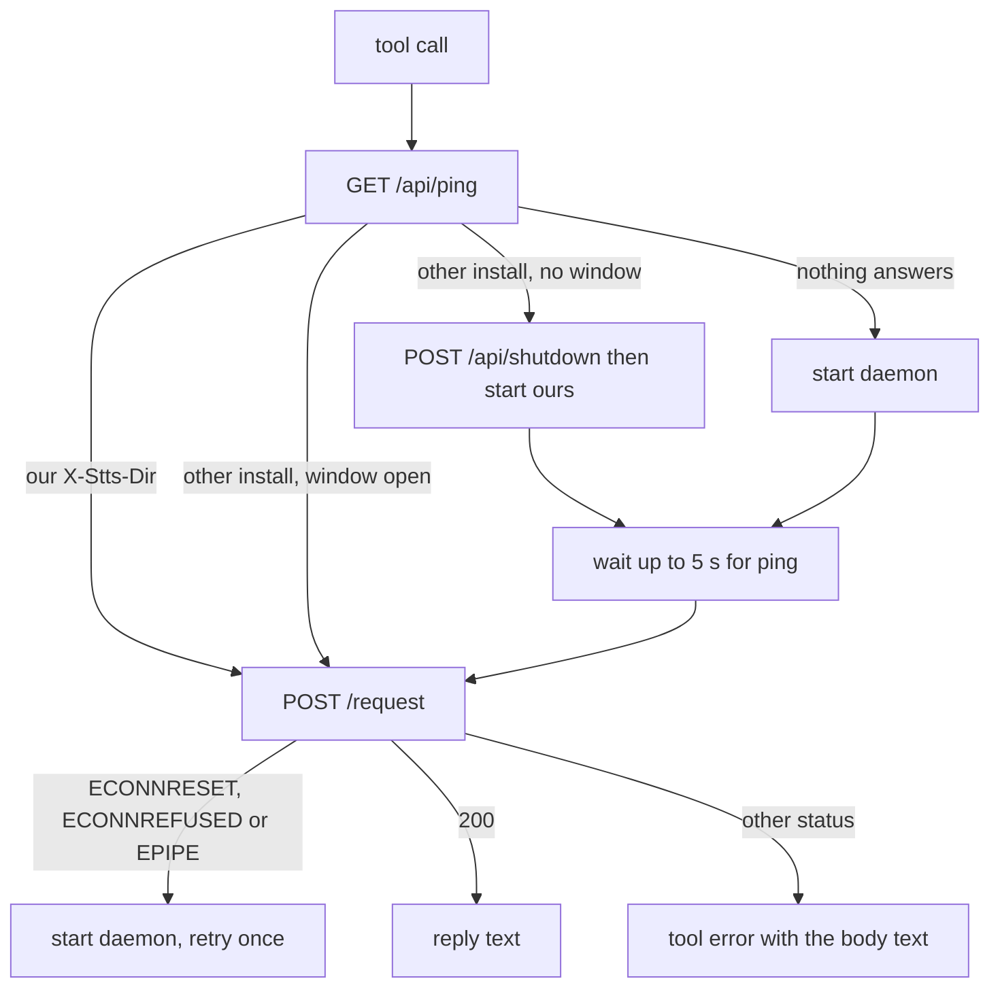

# MCP server and client

## What it does

Gives any agent two tools, `stt` (listen and return what he said) and `tts` (speak, optionally then listen), over the standard Model Context Protocol on stdio. Behind them, a small client finds or starts the daemon and sends the request.

## Why it exists

MCP is how every agent calls tools. The official SDK handles the protocol, so no custom JSON-RPC code exists. The client hides daemon start-up and restarts so the agent just calls a tool.

## How it works

- `src/mcp.ts` registers `stt` and `tts` with the official `@modelcontextprotocol/sdk`. Input schemas and descriptions come straight from `src/protocol.ts` (spec 001), so the notes and sentinels in the descriptions cannot drift.
- `STTS_WHO=agent` marks every call as from a helper agent (its `close` is ignored); anything else means `session`.
- `src/client.ts`:

The daemon is started detached and hidden (`node dist/daemon.js`). The request waits the budget plus 5 seconds.

## What it reads and writes

Reads `STTS_PORT`, `STTS_REQUEST_TIMEOUT_MS`, `STTS_WHO`. Talks HTTP to `127.0.0.1` only.

## How to run, check and hand over

`node dist/mcp.js` after `npm run build`. `test/unit/mcp.test.ts` checks the schemas and that every note and sentinel is in the descriptions; `client.test.ts` checks retry and the stale-install handover. A live check: connect with the SDK's stdio client on a spare `STTS_PORT`, call tts, then stt, then `POST /api/shutdown`.
