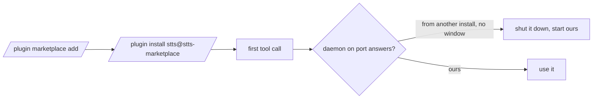

# Install and upgrade

## What it does

Covers how stts gets onto a machine, how it is built, and how a new version replaces a running old one without Mark doing anything.

## Why it exists

An upgrade used to leave the old daemon serving with old code. The install-folder check retires it automatically, and keeping the data folder means his mic permission and settings survive.

## How it works

- Install: `/plugin marketplace add markkennethbadilla/stts`, then `/plugin install stts@stts-marketplace`.
- Upgrade: `/plugin update stts@stts-marketplace`. On the next call the client sees a different `X-Stts-Dir` and replaces the old daemon, unless a conversation is open, in which case the old one finishes first (spec 008).
- Build: `npm run build` runs tsdown (`dist/mcp.js`, `dist/daemon.js`) and Vite (`dist/web/`), and copies the earcons to `dist/earcon/`.
- Data stays in `%LOCALAPPDATA%\cc-gc-stts\`: the Chrome profile (mic grant and settings), Piper, and `daemon.log`. Back up `profile` before moving or deleting it.
- Piper is installed separately into `<data>/piper/venv` with voices in `<data>/piper/voices`; the gateway setup in mkb-agentops provides it.
- Dependencies are pinned to exact versions; Renovate keeps them current.

## What it reads and writes

The plugin folder and the data folder above.

## How to run, check and hand over

`npm ci`, then `npm run check`, then `npm run build`. `test/unit/build.test.ts` checks the build output exists. After an update, call any tool and look for `daemon start pid` in `daemon.log`.
