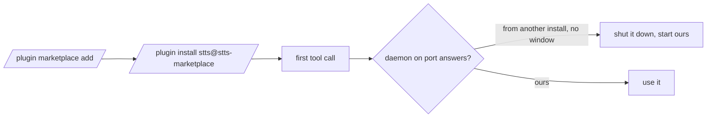

# Install and upgrade

## What it does

Covers how stts gets onto a machine, how it is built, and how a new version replaces a running old one without Mark doing anything.

## Why it exists

An upgrade used to leave the old daemon serving with old code. The install-folder check retires it automatically, and keeping the data folder means his mic permission and settings survive.

## How it works

- Install: `/plugin marketplace add markkennethbadilla/stts`, then `/plugin install stts@stts-marketplace`.
- Upgrade: `/plugin update stts@stts-marketplace`. On the next call the client sees a different `X-Stts-Dir` and replaces the old daemon, unless a conversation is open, in which case the old one finishes first (spec 008).
- Build: `npm run build` runs tsdown and Vite. tsdown bundles `src/mcp.ts` and `src/daemon.ts` into two self-contained files, `dist/mcp.js` and `dist/daemon.js`, with every runtime dependency inlined (only Node builtins stay external, target Node 20), and copies the earcons to `dist/earcon/` and the icons and manifest to `dist/web/`. Vite builds the page into `dist/web/`.
- `dist/` is committed to git. `/plugin install` only copies the repository, with no `npm install` and no build, so the committed `dist/` is what runs. `node_modules/` stays ignored. Every change to `src/`, `web/` or `public/` is committed together with the rebuilt `dist/`; CI runs `npm run build` and then `git diff --exit-code -- dist`, so a stale `dist/` fails the build.
- Data stays in `%LOCALAPPDATA%\cc-gc-stts\`: the Chrome profile (mic grant and settings), Piper, and `daemon.log`. Back up `profile` before moving or deleting it.
- Piper is installed separately into `<data>/piper/venv` with voices in `<data>/piper/voices`; the gateway setup in mkb-agentops provides it.
- Dependencies are pinned to exact versions; Renovate keeps them current.

## What it reads and writes

The plugin folder and the data folder above.

## How to run, check and hand over

`npm ci`, then `npm run check`, then `npm run build`. `test/unit/build.test.ts` checks the build output exists. To prove the plugin runs as installed: `git archive main | tar -x` into an empty folder, and run `node dist/mcp.js` there with no `npm install`. After an update, call any tool and look for `daemon start pid` in `daemon.log`.
