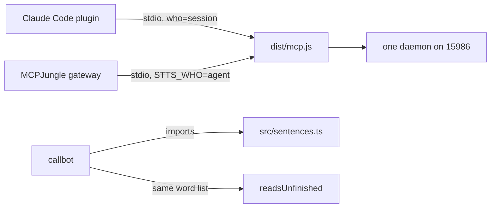

# Gateway and callbot sharing

## What it does

The same `dist/mcp.js` also runs behind the MCPJungle gateway, so every agent on the machine gets the tools as `stts_stt` and `stts_tts`. The callbot (the Google Meet voice bot) shares the sentence cutter and the unfinished-speech rule with stts.

## Why it exists

stts and the callbot are one voice product (house rule 67). Sharing code means a voice change lands in both and they behave the same.

## How it works

- The gateway entry lives in mkb-agentops and points at `dist/mcp.js` with `STTS_WHO=agent`, so a helper agent cannot close Mark's window.
- Both paths share one daemon, so only one conversation is ever live.
- The callbot imports `src/sentences.ts`. Its `turn.mjs` keeps the same `readsUnfinished` word list; a parity test checks they match.

## What it reads and writes

Nothing beyond the MCP server (spec 008).

## How to run, check and hand over

A change to sentences or the word list is made here and in the callbot in the same session, and the parity test runs in both. After a gateway change, call `stts_tts` through the gateway and read `daemon.log`.
