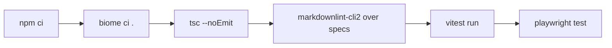

# Tests and CI

## What it does

Lists the checks that must pass before a change lands, and how to run them.

## Why it exists

Two bugs on 2026-10-05 (an undefined name that crashed the page, and mute being undone by a restart) reached Mark because nothing checked them. Each now has a test.

## How it works

- **Style and types:** Biome for lint and format; TypeScript with `@tsconfig/strictest`, no `any` and no suppressions.
- **Specs:** markdownlint-cli2 with `.markdownlint-cli2.jsonc`; rule MD043 makes every `specs/*/spec.md` have exactly the five sections in order.
- **Unit tests (vitest, `test/unit/`):** protocol and fixtures, turns, sentences, daemon through `app.request()`, client, MCP, hook, page machine, page log lines, build output, and the client-to-daemon integration.
- **Live check:** build, start the MCP server on a spare `STTS_PORT` with the SDK stdio client, call tts and stt, read `daemon.log`, then shut down.

- **End-to-end (Playwright, `test/e2e/`, `playwright.config.ts`):** builds, starts the daemon on `STTS_TEST_PORT` (default 15990) with its own data dir under `test-results/`, and drives the page in headless Chromium with a fake speech recogniser, fake media, `page.clock` and a fake Piper server. Page errors fail the run. Cases (`test/e2e/voice.spec.ts`, then `zz-regressions.spec.ts`, which runs last): the narrow-width Send button under the box, Dark Reader lock and theme, no chime on an automatic restart, a fragment of the spoken sentence treated as echo, End reaches the open listen once, leading words across a growing session, a listen produces a turn, pause survives 3 listens and the watchdog, an untrusted End click is ignored, `/notify` produces a background result, a file is read in parts and resumed.
- **CI (`.github/workflows/ci.yml`):** one job on ubuntu-latest for pull requests and pushes to main, path filters, `concurrency` with `cancel-in-progress`, `timeout-minutes: 15`. Runs biome, tsc, markdownlint-cli2, vitest, then installs the Playwright Chromium shell and runs the e2e tests. A run takes about 1 to 3 minutes; at about 40 runs a month that is at most about 120 of the free 2,000 minutes.

## What it reads and writes

Tests use their own ports and fakes; they do not touch the live daemon on 15986.

## How to run, check and hand over

`npm run check` runs biome, tsc, the spec lint and the unit tests; `npm test` runs the spec lint, the unit tests, the build and the Playwright tests, and is the check before every push: CI ran the browser suite but sat red on main for six commits (2026-10-06 to 07) because nobody ran it before pushing. `npm run e2e` runs the Playwright tests alone.
