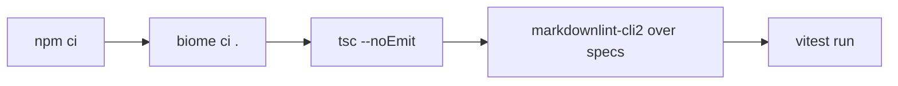

# Tests and CI

## What it does

Lists the checks that must pass before a change lands, and how to run them.

## Why it exists

Two bugs on 2026-10-05 (an undefined name that crashed the page, and mute being undone by a restart) reached Mark because nothing checked them. Each now has a test.

## How it works

- **Style and types:** Biome for lint and format; TypeScript with `@tsconfig/strictest`, no `any` and no suppressions.
- **Specs:** markdownlint-cli2 with `.markdownlint-cli2.jsonc`; rule MD043 makes every `specs/*/spec.md` have exactly the five sections in order.
- **Unit tests (vitest, `test/unit/`):** protocol and fixtures, turns, sentences, daemon through `app.request()`, client, MCP, hook, page machine, page log lines, build output, and the client-to-daemon integration.
- **Live check:** build, start the MCP server on a spare `STTS_PORT` with the SDK stdio client, call tts and stt, read `daemon.log`, then shut down.

Not built yet: Playwright end-to-end tests (fake mic, page errors fail the run, mute survives listens) and a GitHub Actions workflow. When added, the workflow runs on pull requests and main only, with path filters, `concurrency` with `cancel-in-progress`, and `timeout-minutes: 15`, and states its expected minutes per month here.

## What it reads and writes

Tests use their own ports and fakes; they do not touch the live daemon on 15986.

## How to run, check and hand over

`npm run check` runs everything above; `npm test` runs the spec lint and the unit tests.
