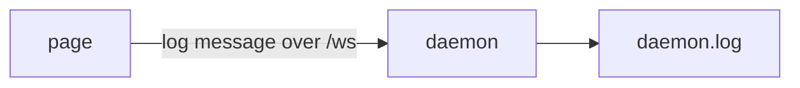

# Logging

## What it does

Writes one line per notable event to `daemon.log` in the data folder, from both the daemon and the page, so a problem can be traced afterwards.

## Why it exists

Voice problems are hard to reproduce. A plain log that tools and people can search shows what happened and when, without recording what Mark said.

## How it works

Each line is an ISO timestamp then the event. Lines from the page start with the word `page`. These lines are searched for and kept word for word:

| Line | From |
| --- | --- |
| `daemon start pid N` | daemon started |
| `daemon exit pid N code C` | daemon stopped |
| `ws bad message` | a WebSocket frame failed the check |
| `chrome launch failed ...` | the window could not open |
| `window gone mid-call: reopening the window in MSms` | the page disconnected while a call was open; the window reopens after MS (spec 003, self-heal) |
| `window did not open: reopening the window in MSms` | a launch failed or no page connected in 15 s while a call was open; it is tried again after MS |
| `piper start failed ...` | Piper could not start |
| `piper clip ok VOICE BYTESB MSms "first 30 chars"` | a clip was made |
| `piper clip failed VOICE MSms "first 30 chars"` | a clip failed |
| `page first audio MSms after the tts, clip of N chars` | the first clip of a tts started playing, MS after the page got the tts |
| `piper clip refused: bad body or voice name` | a clip request with no text or a voice name that is not a file name (an old Windows voice) |
| `page voice fallback REASON` | the page could not play a Piper clip (`clip STATUS VOICE`, `clip unreachable`, `play ERROR`) and spoke it with the browser voice |
| `live update: handing off to DIR` | the daemon is moving to a newer install (spec 013) |
| `page live update: reloading for the new version` | the window reloads onto the new code |
| `page mic start` | mic opened |
| `page mic start timed out at STAGE` | a recogniser start reported nothing within 5 s and was restarted; STAGE is where it waited (cue, on-device check, getUserMedia, recogniser start) |
| `window closed` | the Chrome window closed; the daemon stays up |
| `page heard held for the next listen` | speech with no listen open, kept for the next one |
| `page skipped by Mark` | Skip or Esc stopped the speech |
| `page mic restart #N: reason` | watchdog, error or recogniser-ended restart |
| `page turn sent MSms after the last words, N words (the window showed up to M)` | auto-send fired: the end-of-speech delay, and word counts only (never the words): N below M means the recogniser revised its own text or words were dropped |
| `page light TURN` | the status light changed (notListening, speakNow, heard, background, agentSpeaking) |
| `page mic error ERROR` | speech recognition error |
| `page paused by Mark`, `page resumed by Mark` | mute and unmute |
| `page ws closed` | the page lost the daemon |

What he says is never logged. Clip lines carry only the first 30 characters of the agent's speech.

## What it reads and writes

Appends to `%LOCALAPPDATA%\cc-gc-stts\daemon.log` (on Linux `~/.local/share/cc-gc-stts/daemon.log`). There is no rotation.

## How to run, check and hand over

Read the tail of `daemon.log` after a run. `test/unit/page-log.test.ts` checks the page lines.
