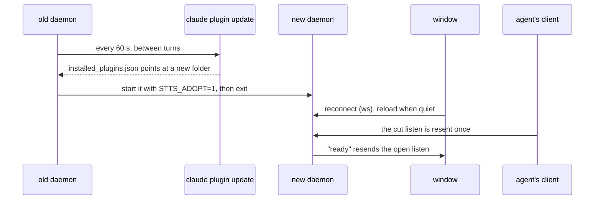

# Live update

## What it does

A new stts version reaches the open voice window by itself, between turns, with no restart of Claude Code, the window or the conversation. The agent's open listen carries on, and words already heard are kept.

## Why it exists

Every fix used to need Mark to close the window and restart the session, in the middle of a call. Mark (2026-10-06): no manual restart after each fix; changes apply in real time.

## How it works

- Every 60 s (`STTS_LIVE_UPDATE_MS`) the daemon runs Claude Code's own updater, `claude plugin marketplace update stts-marketplace` then `claude plugin update stts@stts-marketplace`, but only when it holds nothing or only a listen with no words carried.
- If `~/.claude/plugins/installed_plugins.json` (or `STTS_INSTALLS`) now points the `stts@` entry at another folder whose `dist/daemon.js` exists, the daemon logs `live update: handing off to DIR`, starts that `daemon.js` with `STTS_ADOPT=1` and exits. Chrome stays open.
- The adopted daemon waits up to 10 s for the port, does not open a second window while the old one reconnects (8 s grace), and exits like a closed window if the page does not come back within 15 to 20 s.
- The page reconnects its socket on close. When the daemon folder (`X-Stts-Dir`) changed, it logs `live update: reloading for the new version` and reloads once no speech is playing and no words are held. A listen resent after a reconnect keeps the words already heard.
- The installed daemon sends `X-Stts-Latest: 1` and refuses `/api/shutdown` (409), so a session still running an older MCP client uses it instead of retiring it. Newer clients treat `X-Stts-Latest` as their own daemon.

To force it now instead of waiting up to 60 s: `curl -s -X POST --max-time 150 http://127.0.0.1:15986/api/update`. It runs the same update, answers `up to date` or `updating to DIR`, then hands off at the first safe moment (checked every second for up to 5 minutes).

## What it reads and writes

Reads `installed_plugins.json`. Runs the `claude` CLI, which writes the plugin cache. Writes `daemon.log` lines (spec 012). Environment: `STTS_LIVE_UPDATE` (`0` off, used by the e2e tests; `check` skips the CLI), `STTS_LIVE_UPDATE_MS`, `STTS_INSTALLS`, `STTS_ADOPT` (set by the hand-off only).

## How to run, check and hand over

Nothing to run: it starts with the daemon. Check with `daemon.log`: a `live update: handing off` line, then `daemon start` from the new folder. `test/unit/live-update.test.ts` covers the hand-off decision. A one-off check (2026-10-06) ran daemon A with a window and an open listen, pointed the install file at B: hand-off in 6 s, the page reloaded, and the listen returned the turn spoken after it. The one restart still needed is the first one onto a version that has this feature. The agent's own MCP client is not replaced live: it is a thin HTTP client, and the daemon holds the behaviour.
